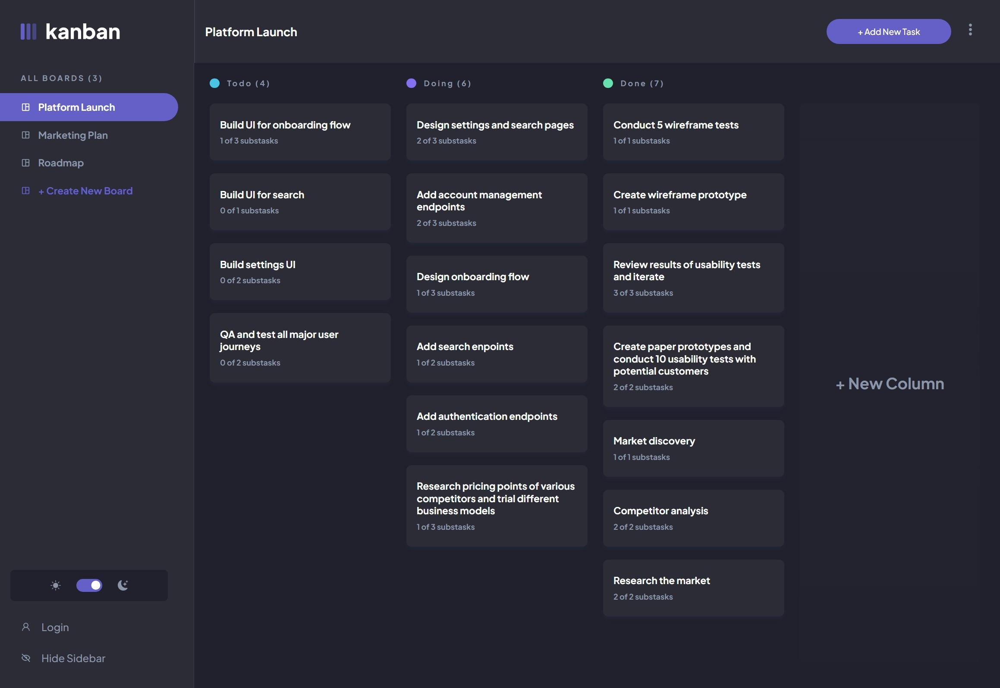

# Frontend Mentor - Kanban task management web app solution

This is a solution to the [Kanban task management web app challenge on Frontend Mentor](https://www.frontendmentor.io/challenges/kanban-task-management-web-app-wgQLt-HlbB). Frontend Mentor challenges help you improve your coding skills by building realistic projects.

## Table of contents

- [Overview](#overview)
  - [The challenge](#the-challenge)
  - [Screenshot](#screenshot)
  - [Links](#links)
- [My process](#my-process)
  - [Built with](#built-with)
  - [What I learned](#what-i-learned)
  - [Continued development](#continued-development)
  - [Useful resources](#useful-resources)
- [Author](#author)
- [Acknowledgments](#acknowledgments)

**Note: Delete this note and update the table of contents based on what sections you keep.**

## Overview

### The challenge

Users should be able to:

- View the optimal layout for the app depending on their device's screen size
- See hover states for all interactive elements on the page
- Create, read, update, and delete boards and tasks
- Receive form validations when trying to create/edit boards and tasks
- Mark subtasks as complete and move tasks between columns
- Hide/show the board sidebar
- Toggle the theme between light/dark modes
- **Bonus**: Allow users to drag and drop tasks to change their status and re-order them in a column
- **Bonus**: Keep track of any changes, even after refreshing the browser (`localStorage` could be used for this if you're not building out a full-stack app)
- **Bonus**: Build this project as a full-stack application

### Screenshot



### Links

- Solution URL: [https://github.com/kamiliano1/karban-task-management](https://github.com/kamiliano1/karban-task-management)
- Live Site URL: [https://karban-task-management.vercel.app/](https://karban-task-management.vercel.app/)

## My process

### Built with

- Semantic HTML5 markup
- Flexbox
- CSS Grid
- Mobile-first workflow
- [React](https://reactjs.org/) - JS library
- [Next.js](https://nextjs.org/) - React framework
- [TailwindCSS](https://tailwindcss.com/)
- [React Recoil](https://recoiljs.org/)
- [React hooks form](https://react-hook-form.com/)
- [React-loading skeleton](https://www.npmjs.com/package/react-loading-skeleton)
- [React-firebase-hooks](https://www.npmjs.com/package/react-firebase-hooks)
- [Firebase](https://firebase.google.com/)
- [radix-ui](https://www.radix-ui.com/)
- [dndkit](https://dndkit.com/)

### What I learned

Drag and Drop
During this project, I've learned how to work with dnd-kit and make draggable content based on examples provided by their playground. You can use drag and drop to change board order on the big screen. You can drag any task between columns. On AddBoardModal and EditBoardModal you can change column order. On AddTaskModal or EditTaskModal you can change the subtask order

Radix-UI
First time I've used it. I wanted to try to improve accessibility features on my project. Beginning was hard but I managed to prepare this app using Radix-UI

FireBase
You can log in by clicking the login button, LoginModal will open if you don't have an account, you have to sign up using RegisterModal and any changes you do to your task will be uploaded to the FireBase. It also tracks if you have DarkMode On and which current opened board.

React-firebase-hooks
Was used for login and sign in purposes

```js
useCreateUserWithEmailAndPassword(auth);

useSignInWithEmailAndPassword(auth);
```

React-loading-skeleton
To improve the user experience when the web is loading

Recoil
For managing states through project
boardAtom - when the page is loaded, it keep all boards, and it's update with every changes
modalAtom - keep tracking if any of the modals are opened and if yes which one should be opened
settingsModalAtom - tracks:

```js
darkMode: boolean;
isSidebarOpen: boolean;
isLoaded: boolean;
activeBoard: string;
isBoardModalListOpen: boolean;
activateColumn: number;
activateTask: number;
activateTaskName: string;
```

### Continued development

On Firebase all users' boards are uploaded with one property, for performance and readability, creating a collection for each board will be better.
In some situations, the code is not DRY. In the future refactor the code to be drier.
Also because the database has a lot of nested levels I'm not sure mapping a couple times to update a task is a good practice but I couldn't find another solution for this

```js
const updatedBoard = boardState.map((board) => {
  if (board.name === settingState.activeBoard) {
    const activatedColumns = board.columns.map((col) => {
      if (col.name === getValues("status")) {
        const updatedTask = col.tasks.map((task) => {
          return task.id === editedTask?.id ? editedTask : task;
        });
        return { ...col, tasks: updatedTask };
      }
      return col;
    });
    return { ...board, columns: activatedColumns };
  }
  return board;
});
```

## Author

- Website - [Kamil Szymon](https://github.com/kamiliano1)
- Frontend Mentor - [@kamiliano1](https://www.frontendmentor.io/profile/kamiliano1)
